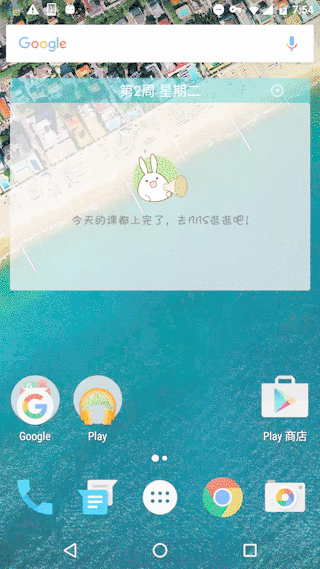

[中文][1] | English

# Evil Hide
This app is used to hide other apps' icon in the launcher.
Note: After hide, the hidden app cannot be launched from anywhere before it is unhide.



### Feature：
- You can choose to hide the icon of this app. Then you can launch it by inputting password in the dial pad.
- No root needed!（Only for rom build from `AOSP` and android version is bigger than 5.0. For example Nexus series, including Nexus 4, Nexus 5, Nexus 5x, Nexus 6p and etc）

### Theory
Before Android 5.0, you can use the following shell commands to hide other apps （root permission is needed!）：
```
adb shell pm endable <package_name>
adb shell pm disable <package_name>
```
After Android 5.0, you can use the following shell commands to hide other apps（root permission is `not` needed!）:
```
adb shell pm hide <package_name>
adb shell pm unhide <packag_name>
```

Difference between disable and unhide：
`hide` is equals to `uninstall -k` which means uninstall application but keep data

### Usage：
The default launch password is `#1234`
Launch method:
Open dial pad，input `#1234`，then press call button. This app will be launched
After that, you can switch the app's hidden state in the list

###待做列表：
- [x] Android M dynamic permission
- [x] Support `hide` and `unhide` commands
- [ ] Use password to launch hidden apps

[1]: https://github.com/blackbbc/Evil-Hide/blob/master/README.md
[2]: https://github.com/blackbbc/Evil-Hide/blob/master/README_en.md
